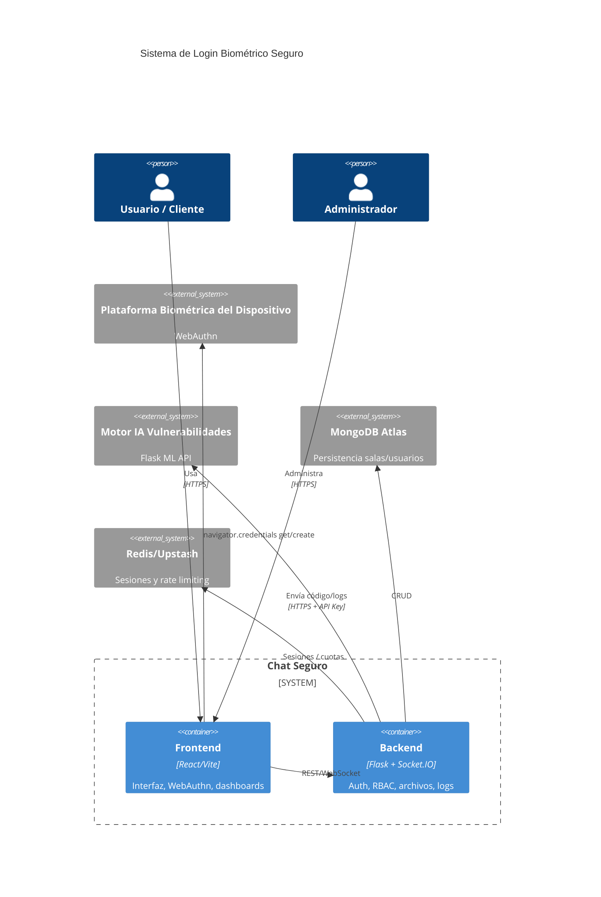
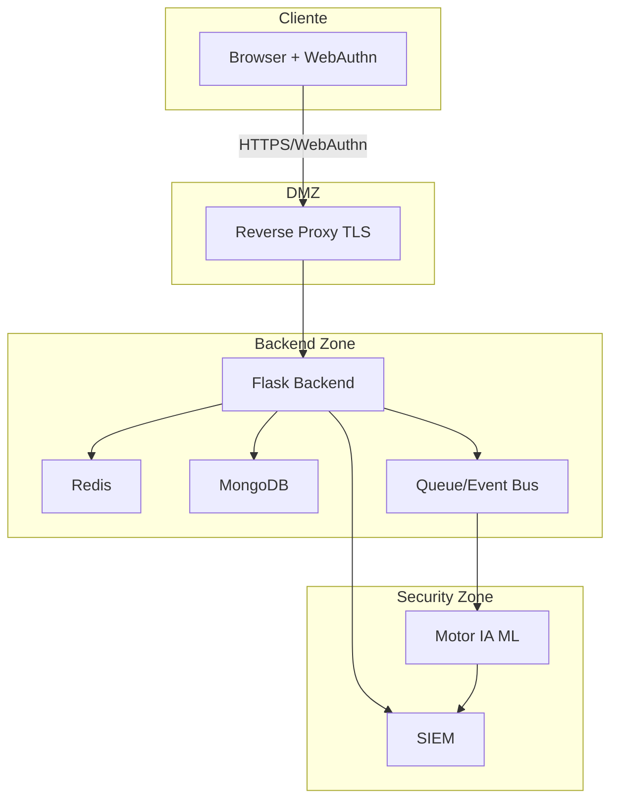

# Arquitectura Integrada

Este documento describe la arquitectura objetivo que integra la autenticación biométrica, el sistema de chat y el motor de IA para detección de vulnerabilidades.

## Componentes Principales

| Capa | Componente | Descripción |
| --- | --- | --- |
| Dispositivo | Sensores biométricos del sistema operativo (FaceID, Windows Hello, sensores dactilares, Android BiometricPrompt) | Se exponen mediante WebAuthn/FIDO2 al navegador. No se persistirá información biométrica en servidores. |
| Frontend | `Chat-Software-seguro-main/chat-espe-frontend-main` | React + Vite. Añade módulo `BiometricAuthProvider` que inicia y valida retos WebAuthn; rutas protegidas para `AdminDashboard`, `UserDashboard`. |
| Backend | `Chat-Software-seguro-main/chat-espe-backend-main` | Flask + Socket.IO. Gestiona registros WebAuthn, verificación de retos, sesiones cortas, RBAC, rate limiting, logging estructurado y colas hacia el motor de IA. |
| IA / Seguridad | `Proyecto-Software-seguro/python` | API Flask (`app.py`) expone `/analyze` y scripts usados en CI para SAST. Se invoca desde el backend o pipelines para validar cada release. |
| Observabilidad | Redis/Upstash, MongoDB Atlas, SIEM externo | Almacenan sesiones rápidas, datos de chat, métricas y logs de seguridad. |

## Vista de Contexto

## Secuencia de Login Biométrico

El archivo `../diagrams/login_sequence.mmd` replica el diagrama de la consigna. Resume:

1. Usuario intenta login.
2. Se ejecuta WebAuthn; si falla, se permite fallback MFA u OTP seguro.
3. El backend verifica la firma y consulta el rol.
4. Admin → dashboard completo (gestión de usuarios, escaneos IA, logs). Cliente → dashboard de perfil con permisos restringidos.
5. Se aplica logout seguro y expiración automática.

## Patrones y Principios

- **Adapter**: capa `BiometricProvider` abstrae WebAuthn para poder usar futuros proveedores (FaceTec, Passkeys). Se injerta en frontend y backend.
- **Strategy**: `AuthFallbackStrategy` selecciona métodos secundarios (OTP, correo, passkey). Desacoplado para cumplir OCP.
- **Observer / Event Bus**: backend emite eventos de seguridad (`login_success`, `login_failure`, `user_created`, `file_flagged`). Suscriptores incluyen auditoría y el conector hacia el motor de IA.
- **SOLID**: servicios de autenticación, repositorios de usuarios, validadores de archivos y clientes IA siguen SRP; dependencias via interfaces para permitir pruebas (DIP); DTOs específicos para separar contratos (ISP, LSP).

## Requerimientos No Funcionales

- Tiempo de respuesta de login < 2 s (promedio). WebAuthn se ejecuta localmente; el backend valida en < 200 ms.
- Escalabilidad: mínimo 100 usuarios concurrentes (Socket.IO + Redis + workers Gunicorn/Uvicorn). Uso de namespaces para segmentar salas.
- Seguridad: TLS obligatorio, CSP estricta, HSTS, validación de entrada/salida, rate limiting, bloqueo temporal tras 5 fallos, monitoreo de integridad.
- Usabilidad: accesibilidad (ARIA, contraste AA), mensajes claros, soporte mobile/desktop.

## Integración con el Motor de IA

1. **Eventos automáticos**: cada push a `Chat-Software-seguro-main` dispara GitHub Actions que llaman a `Proyecto-Software-seguro/scripts/extract_features_from_diff.py`. Si el modelo (Random Forest) supera umbral de riesgo, se bloquea el merge.
2. **Gateway CI**: el microservicio biométrico expone `/api/security/ci-scan`, reutiliza `SecurityIntelligenceClient` y almacena cada ejecución en `audit_logs`. El workflow `biometric-ai-scan` del chat envía el diff con este endpoint y falla si la IA devuelve `MEDIA/CRITICA`.
3. **API runtime**: el backend expone `/security/scan` para que administradores lancen un escaneo manual; internamente consume `Proyecto-Software-seguro/python/app.py` y almacena el resultado.
4. **Reportes**: los hallazgos de IA se muestran en el dashboard admin y se exportan como PDF/HTML usando `generate_basic_report.py`.

## Persistencia de Datos

- **Usuarios/Admins**: MongoDB (`users` collection). Campos: `username`, `role`, `webauthnPublicKey`, `deviceBinding`, `profile`, `auditRefs`.
- **Sesiones**: Redis, TTL 15 minutos, refresh tokens separados. Cada token almacena fingerprint del dispositivo.
- **Logs**: archivo local + streaming a SIEM (Elastic/CloudWatch). Formato JSON con `event_type`, `actor`, `ip`, `device`, `result`, `correlation_id`.
- **Archivos**: bucket S3/MinIO con cifrado server-side. Antes de guardar se ejecutan módulos de detección de esteganografía existentes en el backend.
- **Gateway**: por defecto utiliza SQLite en `gateway/data/gateway.db` (montar volumen persistente). En despliegues activos puede alternar a MongoDB con `GATEWAY_STORAGE_BACKEND=mongo` para permitir múltiples instancias detrás de un balanceador.

## Interacción entre Roles

- **Admin**: crea usuarios, asigna roles, ejecuta auditorías, consulta reportes IA, programa bloqueos. Todas las acciones requieren firma biométrica + token temporal.
- **Cliente**: puede ver y editar datos no sensibles, participar en salas de chat y subir archivos (sujeto a sanitización). No puede acceder a reportes ni a datos de otros usuarios.

## Servicios Auxiliares

- **Rate Limiter**: sliding window 1 min (max 10 intentos) y 1 h (max 50 intentos) por IP + dispositivo. Bloqueos se registran.
- **Notification Service**: se conecta a Telegram (o canales definidos) para alertar de eventos críticos (spoofing detectado, intento de escalada, hallazgo IA > 0.7 risk).
- **Config Service**: centraliza secretos/variables. Uso de `.env` locales + secreto remoto (Azure Key Vault, AWS Secrets Manager). RP ID por ambiente y certificados (`GATEWAY_SSL_CERT`, `GATEWAY_SSL_KEY`) aseguran que WebAuthn valide Windows Hello/huella sólo en dominios autorizados.

## Despliegue de Referencia

## Dependencias Clave

- Python 3.10+, Node 18+, Redis, MongoDB Atlas.
- Bibliotecas WebAuthn sugeridas: `@simplewebauthn/browser` y `@simplewebauthn/server` o `webauthn-json` + validaciones propias en Flask.
- Librerías de seguridad: `Flask-Talisman`, `Flask-Limiter`, `python-jose` (JWT), `cryptography`.
- Testing: `pytest`, `playwright`, `owasp-zap-baseline`, scripts de IA.

## Plan de Evolución

1. Fase 1: integrar WebAuthn + fallback OTP, actualizar dashboards y sesiones.
2. Fase 2: conectar eventos al motor de IA, mostrar hallazgos y bloquear despliegues inseguros.
3. Fase 3: automatizar reportes, telemetría completa, documentación y guías de despliegue.
